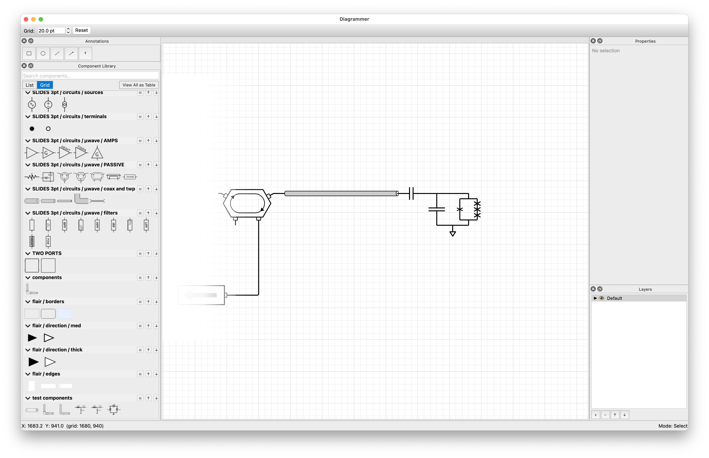

# Diagrammer

Diagrammer is a desktop app for building technical diagrams — circuit
schematics, flowcharts, block diagrams, and anything else you can express
with reusable SVG parts and routed connections — using a drag-and-drop
canvas. The current version focuses on electrical and wiring diagrams from the context of cryogenic microwave circuits and quantum measurement, but the approach is general and should work for any domain where you can define a library of components with connection points, including flowcharts, data pipelines, software architecture diagrams, and whatever else you might cook up.

Components are plain SVG files that you can easily author yourself, so the library grows with whatever domain you work in.



## What it does

Drop components from a library onto a snapping grid, wire them
together with KiCad-style orthogonal autorouting, and annotate the result
with text and LaTeX math. Components rotate, flip, and stretch; wires
auto-shorten leads into rounded corners; selections cut, copy, and paste
with their connection topology intact. Everything is undoable.

Components are simple SVGs with named layers (`artwork`,
`leads`, `ports`, `labels`, `stretch`). While Diagrammer ships with a lot of built-in components, you can also create your own in Inkscape or any SVG editor by following the spec in [docs/svg-component-spec.md](docs/svg-component-spec.md). Just drop your SVG files into categorized subdirectories under `components/` and they will appear in the library panel, or you can simply point to your library directory in the settings.

## Features

- **SVG component library** — drag-and-drop placement, search, favorites,
  and recently-used tracking. Components are plain SVG files you author.
- **KiCad-style wire routing** — orthogonal and 45° autorouting, manual
  waypoint placement, segment dragging, and wire-to-wire T-junctions.
- **Port-based connections** with snap-to-port, snap-to-grid, and
  snap-to-angle.
- **Component transforms** — 90° rotation, fine 15° rotation, horizontal
  and vertical flip, and stretchable bodies for variable-length parts.
- **Rounded wire corners** with dynamic lead shortening so junctions
  meet components seamlessly.
- **Simple shape drawing** — rectangles, ellipses, and lines with
  editable properties and resize handles.
- **Annotations with LaTeX math** — inline `$...$` and display `$$...$$`
  (matrices, `align`, etc.) rendered as resolution-independent SVG. See
  [docs/math-annotations.md](docs/math-annotations.md) for the rendering
  backends and optional system-LaTeX setup.
- **Undo/redo** for every operation, plus cut/copy/paste that preserves
  connection topology.
- **Zoom & pan** — scroll-wheel zoom at cursor, zoom-window mode, fit-all,
  and middle-click pan.
- **Configurable grid** with snap toggle and major/minor visual lines.
- **Persistent settings** for style preferences, routing options, and
  library visibility.

## Installation

### Prebuilt executables (recommended)

Download the latest build for your platform from the
[Releases page](https://github.com/w00ber/Diagrammer/releases/latest):

- **macOS** — `Diagrammer-macOS.zip`. Unzip and drag `Diagrammer.app` to
  `/Applications`. The first time you launch it, macOS will block it
  because the app is unsigned — right-click the app and choose **Open**,
  then confirm. After that it opens normally.
- **Windows** — `Diagrammer-Windows.zip`. Unzip anywhere and run
  `Diagrammer\Diagrammer.exe`. Keep the whole `Diagrammer` folder
  together; the `_internal` directory next to the `.exe` holds the
  bundled dependencies. SmartScreen may warn on first launch — choose
  **More info → Run anyway**.

### From source (for development)

Requires Python 3.10+ and PySide6.

```bash
pip install -e .
```

## Usage

```bash
python -m diagrammer
```

... but the package also provides an entry point:

```bash
diagrammer
```

that you can execute directly from the command line.

Press **Ctrl+?** in the app for the in-app help reference.

## Keyboard Shortcuts

The full reference lives in [docs/help.md](docs/help.md) (also reachable
via **F1**). The bindings below are the **defaults** — they can be
overridden per-user in **Settings → Keyboard Shortcuts**, and the in-app
help reflects whatever the user has currently bound. The most-used
defaults:

| Key | Action |
|-----|--------|
| **Navigation** | |
| A | Zoom all / fit |
| Z | Zoom window mode |
| Middle-click drag | Pan |
| Scroll wheel | Zoom at cursor |
| Ctrl+/- | Zoom in/out (centered) |
| **Components** | |
| Space | Rotate 90° CCW |
| Shift+Space | Rotate 90° CW |
| R | Fine rotate 15° CCW |
| Shift+R | Fine rotate 15° CW |
| F | Flip horizontal |
| Shift+F | Flip vertical |
| Shift+click port | Set rotation pivot |
| **Routing** | |
| T | Toggle trace routing mode |
| Shift (while routing) | Constrain to H/V |
| **Layers** | |
| H | Hide active layer |
| Shift+H | Show active layer |
| L | Lock active layer |
| Shift+L | Unlock active layer |
| **Selection & Alignment** | |
| Shift+click | Multi-select components |
| Ctrl+click port | Select port for alignment |
| Ctrl+Shift+H | Align horizontally |
| Ctrl+Shift+V | Align vertically |
| **Editing** | |
| Delete / Backspace | Delete selected |
| Ctrl+Z | Undo |
| Ctrl+Shift+Z | Redo |
| Ctrl+C / X / V | Copy / Cut / Paste |
| Ctrl+, | Settings |
| Escape | Cancel current operation |

## Creating Components

Components are standard SVG files with named layers. See
[docs/svg-component-spec.md](docs/svg-component-spec.md) for the full
specification. You can open any of the built-in components in Inkscape or Adobe Illustrator to see how they are structured, or as a starting point to create your own.

Quick summary — an SVG component has these layers:

| Layer | Purpose |
|-------|---------|
| `artwork` | Component body (rendered) |
| `leads` | Connection stems (dynamically shortened for rounded corners) |
| `ports` | Connection points (`<circle id="port:name" .../>`) |
| `labels` | Text label placeholders |
| `stretch` | Break lines for stretchable components |

Place component SVGs in categorized subdirectories:

```
components/
  electrical/
    resistor.svg
    capacitor.svg
  flowchart/
    process.svg
```

## Building an app bundle/executable

You can use PyInstaller to create a standalone executable or app bundle for distribution on your own computer. First, install PyInstaller:

```bash
pip install pyinstaller
```

Then, run the following command from the root of the project:

```bash
pyinstaller diagrammer.spec
```
The app bundle or executable will be created in the `dist/` directory. For macOS, this will be `dist/Diagrammer.app`. For Windows, it will be `dist/diagrammer.exe` + a `_internal` directory that contains the necessary dependencies. You will need to distribute both the executable and the `_internal` directory together.

## Further reading

- [docs/math-annotations.md](docs/math-annotations.md) — LaTeX math
  syntax, rendering backends, and system-LaTeX setup.
- [docs/svg-component-spec.md](docs/svg-component-spec.md) — full SVG
  component specification.
- [docs/help.md](docs/help.md) — in-app help and complete shortcut
  reference.

## License

MIT
