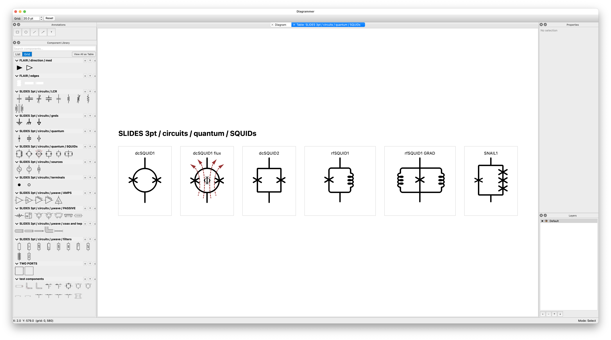

# Diagrammer Tutorial
*040826 J. Aumentado*

## First Steps
Let's build a simple circuit diagram. 

### Moving things

### Rotating/flipping/stretching components

### Wiring things together
***`W` is for 'wire.'*** 

## Annotation
### Math-y annotations

## Exporting
### PDF/SVG/PNG
*File->Export* to save your diagram as a PDF, SVG, or PNG. The PDF and SVG exports are convenient for further editing in vector graphics software, while the PNG export is a quick way to get a raster image for presentations or sharing.

### ...or via the paste buffer
Copy your diagram to the clipboard with *Edit->Copy* (or **Ctrl+C**), then paste it directly into another app like PowerPoint, Keynote, Illustrator, Inkscape, etc. The pasted content is a vector graphic just like the PDF/SVG export, but it skips the step of saving and re-importing a file. 

## Saving and Loading
Diagrammer saves your work in a custom JSON-based format with the extension `.diag`. Use *File->Save* to save your diagram, and *File->Open* to load it back up later. This preserves all your components, connections, annotations, and layout. 

## Library Management
### Filesystem libraries
By default, Diagrammer looks for components in the `components/` directory. You can organize your components into subdirectories (e.g., `components/electrical/`, `components/flowchart/`, etc.) and they will appear in the library panel under corresponding categories. If you are using the standalone executable, the location of this directory depends on your OS. On Windows, it's in the same directory as the executable. On macOS, it's inside the app bundle at `Diagrammer.app/Contents/Resources/components/`. You can also specify additional library directories in *Settings->Library Paths*.

### Library Table View
The Component Library panel has limited real estate so the thumbnails are limited in size. To see more detail, you can open a "table view" of any category that shows larger thumbnails along with component names and cell borders. To open a table view, right-click on a category in the tree view and select "View as Table", or click the small "table" button in the category header. Each table view opens in a new tab, and you can have multiple tables open at once. The table view is read-only.

## Keyboard Shortcuts
Diagrammer is keyboard shortcut heavy by choice. Generally there are a lot of actions available for GUI editors like this and the interface can get VERY cluttered. Once you get the hang of it, keyboard shortcuts can significantly speed up your workflow. The full reference is in [docs/help.md](docs/help.md) (also reachable via **F1** in the app). However, the current defaults are very-much biased towards right-handed users on a QWERTY layout. For this reason, all shortcuts are fully customizable in *Settings->Keyboard Shortcuts* — you can rebind any action to whatever key combination works best for you, and the in-app help reference will reflect your custom bindings.