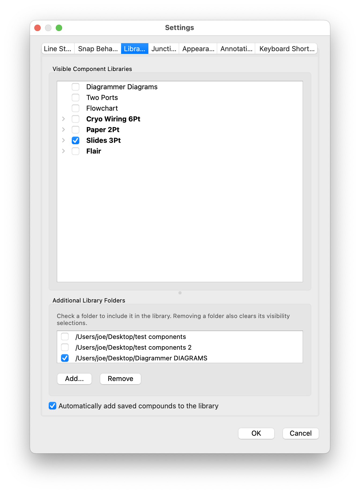
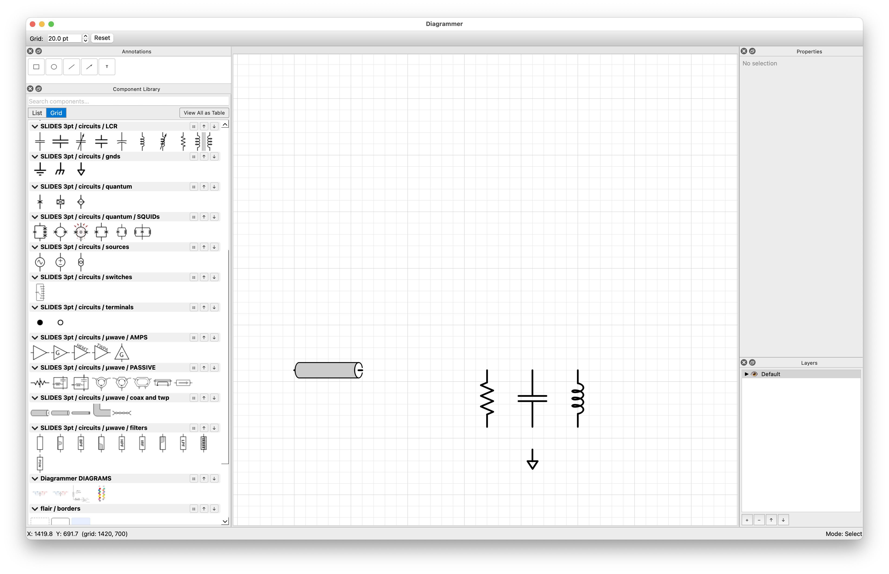
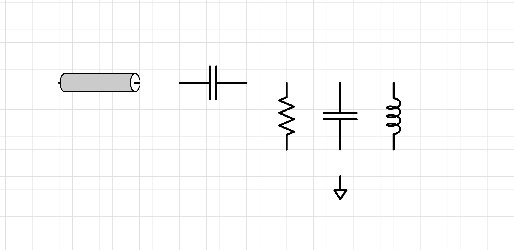

# Diagrammer Tutorial
*040826 J. Aumentado*

## First Steps
Let's build a simple circuit schematic to walk through the basics. We're going to make a simple capacitively-coupled parallet $LCR$ circuit.

When you start the app, the main canvas will be blank. The left sidebar is the component library, where you can drag and drop parts onto the canvas. The library only shows what's been set as *visible* in Settings → Libraries (Ctrl+,). For this, we'll turn on *SLIDES 3pt*. This is a selection of electrical components that are designed for presentation slides, with default 3pt wide leads.

With this library visible, you can see either a List or Grid view of the components. Grid view is more compact. Under *SLIDES 3pt / circuits / LCR* are symbols for inductors, capacitors, etc. These are actually thumbnails of the full SVG components. Each thumbnail has a tooltip that shows the file name when you hover over it. Some of the elements have variants and look similar (e.g., maybe different length leads or line weights), so the tooltip is a helpful way to confirm which one you're dragging out. For this, drag out onto the canvas one of each: `IND1`, `CAP1`, and `RES1`, as well as `GND3` from the *SLIDES 3pt / circuits / grounds* and `COAX1_MED` from *SLIDES 3pt / circuits / µwave / coax and tmp*. Place the $L, C,$ and $R$ in a row to form a parallel LCR circuit, with the coax feeding in from the left and the ground at the bottom. Grid snapping is on by default, so the components will snap to the nearest grid point as you move them around. 

You can zoom in/out using the mouse scroll wheel, `Ctrl+Plus/Minus`, or the Zoom tool (`Z`). To pan around, hold the middle mouse button and drag. If you want to quickly fit the whole diagram in view, use `Ctrl+0` or `A`. You should see something like this:

### Alt-Click (Opt-Click on Mac) dragging to duplicate
Since we'll also want a coupling capacitor between the coax and the LCR node, we can either drag out another capacitor from the library, or we can copy/paste the existing one. You can use the normal `Ctrl+C/V` shortcuts or you can `Option` (mac)/`Alt` (Win) + click-drag to duplicate. Place the new capacitor between the coax and the LCR node. Since it's by default vertically oriented, we'll need to rotate it 90° so the leads are horizontal. With the capacitor selected, press Space Bar to rotate 90° counter-clockwise. You can rotate in smaller increments with the `R`/`Shift-R` key. 

### Moving things
To move components around, just click and drag them. You can select multiple components by holding `Shift` and clicking on them, or by dragging a selection box around them. Once selected, you can move the whole group together. By default, snapping to a grid is on, so the components will snap to the nearest grid point as you move them. You can toggle it via the menu, View → Snap to Grid. The program will try to seYou can also snap to other components or to specific angles by holding `Shift` while moving. When you grab a component with ports, the port nearest the cursor will be highlighted. If you grab the component by that port, it will use that port as the point to snap to the grid points. 

If your components aren't yet aligned to the grid, select an end (port) of the component and move it into place so that the the $R$, $L$, and $C$ are aligned as in the picture

### Rotating/flipping/stretching components
#### Rotation
There are two ways to rotate components:
- **90° rotation** with the Space Bar. This is a quick way to rotate in 90° increments. By default, it rotates counter-clockwise, but if you hold Shift while pressing Space, it rotates clockwise instead.
- **Fine rotation** with the `R` key. This rotates in smaller increments (15° by default) for more precise control. Again, holding Shift reverses the direction. You can adjust the fine rotation angle in Settings → Preferences if you want a different increment.

#### Flipping
You can flip components horizontally or vertically with the `F` key. Pressing `F` flips horizontally, while `Shift+F` flips vertically. This is useful for components that are symmetrical

### Wiring things together
You can connect components together with wires. Toggle the wire tool with `W` (for wire). In this mode you can connect a port from one component directly to another. The wire width defaults can be set in Settings → Preferences → Line Style. The wires will automatically route orthogonally and shorten leads to meet the component boundaries with nice rounded corners. You can also add manual waypoints by clicking while drawing a wire, and you can drag existing waypoints to adjust the routing. To create a T-junction between two wires, just draw a new wire that connects to the middle of an existing wire.

## Annotation
### Math-y annotations

### Shapes: rectangles, ellipses, lines/arrows

## Other useful features
### Importing images
You can paste SVGs directly in the canvas from the clipboard. You can create compound components by right-clicking a selection and choosing "Create Component from Selection". This will bundle the selected items into a new component that you can reuse in the library. This is handy if you have, for instance, a logo or a custom symbol that you want to use across multiple diagrams. 

### Altering the appearance of a component after placement
Although components can be altered by editing the underlying SVG file, you can also make some adjustments directly in the app after placing them on the canvas. For example, you can change the line color and width of a component instance without affecting the original SVG file. To do this, double-click a component to turn its selection box into an orange dashed line.  This allows you to customize the look of individual instances while keeping the original component intact for reuse.

## Exporting
### PDF/SVG/PNG
*File->Export* to save your diagram as a PDF, SVG, or PNG. The PDF and SVG exports are convenient for further editing in vector graphics software, while the PNG export is a quick way to get a raster image for presentations or sharing.

### ...or via the paste buffer
Copy your diagram to the clipboard with *Edit->Copy* (or **Ctrl+C**), then paste it directly into another app like PowerPoint, Keynote, Illustrator, Inkscape, etc. The pasted content is a vector graphic just like the PDF/SVG export, but it skips the step of saving and re-importing a file.

### Export scaling

By default, exports are scaled to **33 %** of the on-screen scene size. Components are designed at large, round-number sizes (e.g. 100 pt strokes, 20 pt grid) for easy SVG authoring, then shrunk automatically on export. A 100 pt object at 33 % becomes ~33 pt in the output file. You can change this in *Settings > Export*. The scale applies to all export formats (SVG, PNG, PDF) and clipboard copies.

## Saving and Loading
Diagrammer saves your work in a custom JSON-based format with the extension `.dgm`. Use *File->Save* to save your diagram, and *File->Open* to load it back up later. This preserves all your components, connections, annotations, and layout. 

## Library Management
### Filesystem libraries
By default, Diagrammer looks for components in the `components/` directory. You can organize your components into subdirectories (e.g., `components/electrical/`, `components/flowchart/`, etc.) and they will appear in the library panel under corresponding categories. If you are using the standalone executable, the location of this directory depends on your OS. On Windows, it's in the same directory as the executable. On macOS, it's inside the app bundle at `Diagrammer.app/Contents/Resources/components/`. You can also specify additional library directories in *Settings->Library Paths*.

### Library Table View
The Component Library panel has limited real estate so the thumbnails are limited in size. To see more detail, you can open a "table view" of any category that shows larger thumbnails along with component names and cell borders. To open a table view, right-click on a category in the tree view and select "View as Table", or click the small "table" button in the category header. Each table view opens in a new tab, and you can have multiple tables open at once. The table view is read-only.

## Keyboard Shortcuts
Diagrammer is keyboard shortcut heavy by choice. Generally there are a lot of actions available for GUI editors like this and the interface can get VERY cluttered. Once you get the hang of it, keyboard shortcuts can significantly speed up your workflow. The full reference is in [docs/help.md](docs/help.md) (also reachable via **F1** in the app). However, the current defaults are very-much biased towards right-handed users on a QWERTY layout. For this reason, all shortcuts are fully customizable in *Settings->Keyboard Shortcuts* — you can rebind any action to whatever key combination works best for you, and the in-app help reference will reflect your custom bindings.