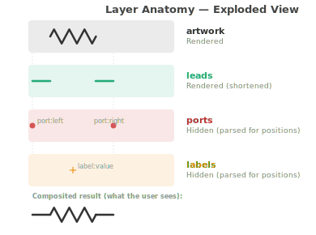
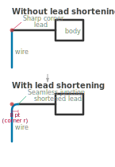
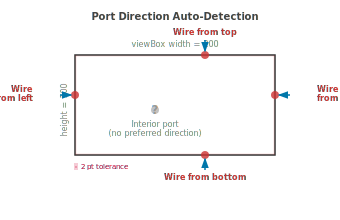
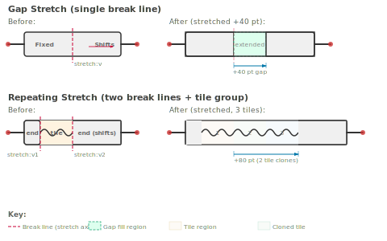
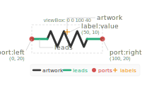

# SVG Component Specification

This document defines the SVG structure required for Diagrammer components. Components are standard SVG files with specific named layers that Diagrammer uses for rendering, port detection, lead management, and stretchability.

## Units and Scaling

Diagrammer renders SVG components at **1:1 with the viewBox dimensions**. One viewBox unit equals one scene point (pt).

| Concept | Value |
|---------|-------|
| 1 viewBox unit | 1 pt (scene unit) |
| Default grid spacing | 20 pt |
| Default wire stroke width | 3 pt |
| Default corner radius | 8 pt |

**Artboard sizing in Illustrator:** Set your artboard to the exact size you want the component to appear in the diagram. The artboard dimensions become the SVG `viewBox`, which defines the component's display size. There is no automatic scaling.

**Grid alignment tip:** Design port positions at multiples of the grid spacing (20 pt) for clean alignment. For example, place ports at x=0, x=20, x=40, x=60, x=80, x=100, and y values at multiples of 20.

## SVG Root Element

```xml
<svg xmlns="http://www.w3.org/2000/svg" viewBox="0 0 {width} {height}">
```

- The `viewBox` defines the component's coordinate space and display size.
- Do **not** nest all content inside a single wrapper `<g>` (e.g., no `<g id="Layer_1">`). All named layers should be direct children of `<svg>`.

**Illustrator note:** By default, Illustrator wraps all content in a `<g id="Layer_1">`. To avoid this, either:
- Manually edit the exported SVG to move groups to the root level, or
- Use multiple top-level layers in Illustrator named `artwork`, `ports`, `leads`, etc.

## Layer Hierarchy

All layers are `<g>` elements with specific `id` attributes, placed as **direct children of the `<svg>` root**:

```xml
<svg xmlns="http://www.w3.org/2000/svg" viewBox="0 0 100 60">
  <defs>...</defs>

  <g id="artwork">    <!-- visible component body (always rendered) -->
    ...
  </g>

  <g id="leads">      <!-- connection lead lines (shortened at render time) -->
    ...
  </g>
  <!-- Or, for stretchable components, split leads by direction
       (preferred — each group rides as a unit with its port): -->
  <!-- <g id="leads-left">...</g> <g id="leads-right">...</g>      -->
  <!-- <g id="leads-top">...</g>  <g id="leads-bottom">...</g>     -->

  <g id="ports">      <!-- port markers (hidden, parsed for positions) -->
    ...
  </g>

  <g id="labels">     <!-- label placeholders (hidden, parsed for positions) -->
    ...
  </g>

  <g id="stretch">    <!-- stretch axis definitions (hidden, parsed) -->
    ...
  </g>

  <metadata>           <!-- optional component metadata -->
    ...
  </metadata>
</svg>
```

### Rendering behavior

| Layer | Rendered? | Purpose |
|-------|-----------|---------|
| `artwork` | Yes | The main visual body of the component |
| `leads` | Yes (modified) | Lead/stem lines connecting the body to ports. Shortened at render time to accommodate wire corner rounding. Per-coordinate stretch shifting. |
| `leads-left` / `leads-right` / `leads-top` / `leads-bottom` | Yes (modified) | Same as `leads` but tagged by direction. Each group translates as a single unit when stretched (preferred for stretchable components). |
| `ports` | No (hidden) | Defines connection port positions |
| `labels` | No (hidden) | Defines label placeholder positions |
| `stretch` | No (hidden) | Optional explicit stretch break axes. When absent, axes are inferred from `tile` and direction-tagged leads. |
| `tile` | Yes (cloned) | Tile unit for repeating stretch (inside artwork) |
| `decorative` | No (hidden) | Marks component as freely resizable |
| `snap` | No (hidden) | Defines grid snap anchor point |

Diagrammer sets `display="none"` on `ports`, `labels`, `stretch`, `snap`, and `decorative` layers before rendering. The `artwork` and `leads` layers are always rendered, but `leads` elements may be modified (shortened) based on connected wire properties.



## Layer Details

### `artwork` — Component Body

Contains the main visual elements of the component (coil windings, capacitor plates, resistor zigzag, logic gate shape, etc.). This is everything **except** the straight lead/stem lines that connect the body to the ports.

```xml
<g id="artwork">
  <!-- Resistor zigzag -->
  <path d="M21.9,20 l4.7-10.9 9.4,21.9 ..." stroke="#000" stroke-width="3" fill="none"/>
</g>
```

### `leads` — Connection Leads

Contains the straight line segments that connect the component body to the port positions. These are the "stems" or "wires" that extend from the component body to the connection points.

**Why a separate layer?** When a wire connects to a port with corner rounding enabled, Diagrammer shortens the lead line to accommodate the rounded corner. The wire's rounded transition replaces the end of the lead, creating a seamless visual junction.



```xml
<g id="leads">
  <!-- Left lead: horizontal line from port (x=0) to body (x=22) -->
  <path d="M0,29.6 H22.2" stroke="#000" stroke-width="3"
        stroke-linecap="round" fill="none"/>

  <!-- Right lead: horizontal line from body (x=76) to port (x=98) -->
  <path d="M76.2,29.6 H98.4" stroke="#000" stroke-width="3"
        stroke-linecap="round" fill="none"/>
</g>
```

**If no `leads` layer exists:** The component renders entirely from `artwork` with no automatic lead shortening. Wires connect directly to ports with whatever corner style the routing produces. This is fine for components without straight lead stems, or when seamless rounded junctions aren't needed.

**Lead requirements (when using the `leads` layer):**
- Use the same stroke width as the default wire width (3 pt) for seamless joins.
- Use `stroke-linecap="round"` for clean endpoints.
- Each lead should be a simple straight line (horizontal or vertical) from the component body to a port position.
- The lead's endpoint must coincide with the corresponding port's position.

#### Direction-tagged leads (preferred for stretchable components)

Instead of one `leads` group, split leads by the port they serve:

| Group ID       | Behavior under stretch                                       |
| -------------- | ------------------------------------------------------------ |
| `leads-left`   | Stays anchored to the left edge — does not move              |
| `leads-right`  | Translates by the horizontal stretch amount as a single unit |
| `leads-top`    | Stays anchored to the top edge — does not move               |
| `leads-bottom` | Translates by the vertical stretch amount as a single unit   |

Why prefer this over the legacy `leads` group? With direction-tagged groups Diagrammer applies a single `transform="translate(dx,0)"` (or `translate(0,dy)`) to the whole group, so every path, polygon, and shape inside rides together. The legacy `leads` group is shifted **per coordinate** based on whether each value lies past the stretch break — which is fragile when an Adobe-exported path begins with one absolute moveto followed by relative segments and the moveto rounds to just shy of the break (the path stays put while the arrowhead next to it slides).

```xml
<g id="leads-left">
  <!-- Left-side leads stay put when the component stretches horizontally -->
  <path d="M0,10 H17" stroke="#000" stroke-width="3"
        stroke-linecap="round" fill="none"/>
</g>

<g id="leads-right">
  <!-- Right-side leads + arrowhead translate together with the right port -->
  <path d="M27,10 c…"
        stroke="#000" stroke-width="3" stroke-linecap="round" fill="none"/>
  <polygon points="53,12 60,10 53,8" fill="#000"/>
</g>
```

You can mix direction-tagged groups with a legacy `leads` group; the legacy group still uses per-coordinate shifting. Direction-tagged groups also receive lead shortening, style overrides, and id/class prefixing on compound export — no other authoring changes required.


**Avoiding visible "comb teeth" on smooth strokes.** When a path is built from many short cubic-Bézier segments (typical of Adobe-Illustrator wave / oscillator artwork), each segment-to-segment join with the SVG default `stroke-linejoin: miter` produces a small spike. Across dozens of segments these spikes look like a regular jagged pattern. Set `stroke-linejoin: round` on the relevant CSS class (or attribute) to absorb those joins:

```css
.st1 {
  stroke: #0e72ba;
  stroke-linecap: round;
  stroke-linejoin: round;   /* avoids miter-spike artifacts */
  stroke-width: 1.7px;
}
```

**Adobe Illustrator export precision.** When you author or paste a smooth path in Illustrator and then **Save As → SVG**, the export's *Decimal Places* setting controls how aggressively coordinates are rounded. The default is **1**, which is far too coarse for typical component viewBoxes — a control point at `(17.4523, 13.9217)` rounds to `(17.5, 13.9)`, and across a smooth multi-segment cubic those rounding errors break G1 continuity at the joints, producing visibly kinked curves. (You can spot this by reopening the saved SVG in Illustrator: the curves there will look just as jagged as in Diagrammer — the precision is already lost in the file.)

In the **SVG Options** dialog, expand **More Options** and set:

- **Decimal Places: 3** (or **4** if your viewBox is unusually small).
- **CSS Properties: Style Elements** — emits a single `<style>` block with `.st0`/`.st1`/… class rules, matching the convention of the bundled components. ("Style Attributes" inlines `style="…"` on every element, which works but defeats the per-class style-override system Diagrammer uses.)

A complementary practice: author at a **larger working viewBox** (e.g., `0 0 600 200` instead of `0 0 60 20`). Adobe's interactive tools are less twitchy at larger scales, and any residual rounding error becomes proportionally smaller. The on-canvas rendered size in Diagrammer is unaffected — viewBox sets the internal coordinate system, not the placed size.

Don't open and re-save an already-degraded SVG to "fix" it — each Save round-trip compounds the precision loss. If a component looks wrong, re-export from the original Illustrator source with higher Decimal Places.

### `ports` — Connection Ports

Defines where wires can connect to the component. Each port is a `<circle>` element with a specific `id` format.

```xml
<g id="ports">
  <circle id="port:left"   cx="0"    cy="29.6" r="3"/>
  <circle id="port:right"  cx="98.4" cy="29.6" r="3"/>
  <circle id="port:top"    cx="50"   cy="0"    r="3"/>
  <circle id="port:bottom" cx="50"   cy="60"   r="3"/>
</g>
```

**Port naming:** `id="port:{name}"` where `{name}` is a descriptive identifier (e.g., `left`, `right`, `top`, `bottom`, `in`, `out`, `gate`, `drain`, `source`).

**Port positioning:** The `cx`/`cy` attributes define the exact connection point in viewBox coordinates. Place ports at the ends of lead lines, typically on the viewBox edges.

**Approach direction:** Diagrammer auto-detects the port's lead direction based on its position relative to the viewBox edges:

| Port position | Detected approach direction |
|--------------|---------------------------|
| `cx` near 0 (left edge) | Wire approaches from left |
| `cx` near viewBox width (right edge) | Wire approaches from right |
| `cy` near 0 (top edge) | Wire approaches from top |
| `cy` near viewBox height (bottom edge) | Wire approaches from bottom |
| Interior position | No preferred direction |

Edge detection tolerance: 2 pt from the viewBox edge.



**Recommendation:** Always define at least one port, even for simple shapes. Ports control snap-to-grid alignment and connection behavior.

### `labels` — Label Placeholders

Defines positions where text labels can be placed on the component.

```xml
<g id="labels">
  <text id="label:value" x="50" y="15"/>
  <text id="label:name"  x="50" y="45"/>
</g>
```

**Label naming:** `id="label:{name}"` where `{name}` identifies the label type.

### `stretch` — Stretch Axes (optional override)

Defines break lines for stretchable components. A break line indicates where the component can be stretched along a particular axis.

```xml
<g id="stretch">
  <!-- Vertical break line at X=60: component stretches horizontally -->
  <line id="stretch:v" x1="60" y1="0" x2="60" y2="20"/>

  <!-- Horizontal break line at Y=30: component stretches vertically -->
  <line id="stretch:h" x1="0" y1="30" x2="100" y2="30"/>
</g>
```

#### When you can omit the stretch layer

For each axis, Diagrammer infers stretchability from the new layer convention if no `<g id="stretch">` declaration exists for that axis:

1. **Repeat stretch** is inferred from a `<g id="tile">` group inside `<g id="artwork">`. The tile element's bbox along the stretch axis (X for horizontal, Y for vertical) becomes the repeat region. The axis is chosen by which direction-tagged lead groups are present (`leads-left`/`leads-right` → horizontal, `leads-top`/`leads-bottom` → vertical). With no directional leads at all, a tile is assumed to be horizontal.
2. **Anchored gap stretch** is inferred from direction-tagged lead groups when no tile is present. The break line sits between the inner edges of the two groups (`leads-left.right` ↔ `leads-right.left`, or top/bottom equivalents) so the moving lead group translates while everything else stays put.
3. The **explicit stretch layer takes precedence per-axis**: if you declare `stretch:v` but not `stretch:h`, Diagrammer uses your X-axis declaration and infers Y from the layer convention.

When to keep an explicit `<g id="stretch">`:

- Your tile element extends visually past its repeat region (e.g., overlapping rounded caps), so the bbox-based inference would be too wide. Declare `stretch:v1`/`v2` precisely.
- You want gap stretch on a component with no direction-tagged leads (legacy `<g id="leads">` only).
- Your component has artwork past the tile region that should stay anchored differently than what the inferred break line would do.

**Gap stretch (single break line):**
- A vertical break line (`stretch:v`) at X=B means: everything with X > B shifts right when the component is stretched horizontally.
- A horizontal break line (`stretch:h`) at Y=B means: everything with Y > B shifts down when stretched vertically.
- SVG element coordinates beyond the break line are modified at render time.
- Port positions beyond the break also shift accordingly.
- The SVG content at the break line is extended to fill the gap (vector stretch, not raster).

> **Tip:** Direction-tagged lead groups (`leads-right`, `leads-bottom`) are *not* per-coordinate-shifted — they translate as a unit by the stretch amount, regardless of where their inner coordinates fall relative to the break. The break line still applies to the legacy `leads` group and to `artwork`. Use direction-tagged groups whenever a lead path uses Adobe-style `M` + relative-curves authoring (the moveto can land just shy of the break and detach the rest of the path).

**Repeating stretch (two break lines):**

Defines a tile region between two break lines. When stretched, the content between the breaks is repeated (tiled) to fill the new length. Content outside the region stays intact; content beyond the second break shifts.

```xml
<g id="stretch">
  <!-- Horizontal repeating: tile content between X=20 and X=40 -->
  <line id="stretch:v1" x1="20" y1="0" x2="20" y2="20"/>
  <line id="stretch:v2" x1="40" y1="0" x2="40" y2="20"/>

  <!-- Vertical repeating: tile content between Y=10 and Y=30 -->
  <line id="stretch:h1" x1="0" y1="10" x2="100" y2="10"/>
  <line id="stretch:h2" x1="0" y1="30" x2="100" y2="30"/>
</g>
```

- The stretch amount snaps to integer multiples of the tile width (break2 - break1)
- **Design tip:** Make the tile width an integer multiple of the grid spacing (20pt) so ports still align to the grid after stretching
- Elements beyond the second break line shift by the total growth amount
- **Tile content must be in a `<g id="tile">` group** within the artwork layer. Only this group is cloned and repeated. If no tile group is found, the entire artwork is cloned with clipPath clipping (less reliable).

```xml
<g id="artwork">
  <!-- Left end cap (not repeated) -->
  <path d="..."/>

  <!-- Tile unit: this group is cloned and repeated -->
  <g id="tile">
    <path d="..."/>  <!-- one period of the repeating pattern -->
  </g>

  <!-- Right end cap (not repeated, shifts right) -->
  <path d="..."/>
</g>
```

**Important:** The tile group should contain ONLY the geometry between the two break lines. Paths should not extend beyond the break boundaries.



### `decorative` — Decorative Component Marker

An empty `<g id="decorative"/>` element marks the component as **decorative** — freely resizable in both width and height with no ports or leads. These are intended for visual elements like borders, shaded regions, title blocks, and other non-electrical decorations.

```xml
<g id="decorative"/>
```

Decorative components:

- Show resize handles on all 4 edges when selected (like shape items)
- Scale the entire SVG to fit the current size (no break-line stretching)
- Have no ports, leads, or connection behavior
- Can define a **snap point** for grid alignment (see below)

**Auto-detection:** A component is also treated as decorative if it has no ports and has a snap point defined (even without the explicit `<g id="decorative"/>` marker).

### `snap` — Snap Anchor Point

Defines a single point used for grid snapping when the component is dragged. Most useful for decorative components that have no ports.

```xml
<g id="snap">
  <circle cx="0" cy="0" r="2"/>
</g>
```

The `cx`/`cy` attributes define the snap anchor in viewBox coordinates. Common choices:

- `(0, 0)` — top-left corner (useful for shaded regions placed behind circuits)
- `(width/2, height/2)` — center (default behavior for regular components)

If no snap layer is defined, the component center is used for grid snapping.

### `metadata` — Component Properties

Optional metadata for component behavior.

```xml
<metadata>
  <component
    stretch-h="true"
    stretch-v="false"
    min-width="60"
    min-height="20"/>
</metadata>
```

| Attribute | Type | Description |
|-----------|------|-------------|
| `stretch-h` | boolean | Can be stretched horizontally |
| `stretch-v` | boolean | Can be stretched vertically |
| `min-width` | number | Minimum width when stretched (pt) |
| `min-height` | number | Minimum height when stretched (pt) |

## Style Guidelines

### Stroke widths
- **Lead lines:** 3 pt (matches default wire width for seamless connections)
- **Component body:** 3 pt recommended for consistency; other widths allowed for visual distinction

### Stroke caps and joins
- **Leads:** `stroke-linecap: round` (blends smoothly with wire endpoints)
- **Body:** `stroke-linecap: round; stroke-linejoin: round` recommended

### Colors
- Default: `#000` (black) for strokes
- Components may use custom colors; lead lines should match the wire color for seamless joins (default `#000`)

### Fill
- Most electrical components: `fill: none` (transparent)
- Flowchart shapes: `fill: white` or light colors for solid backgrounds

## Component Library Organization

Components are organized in a directory tree:

```
components/
  electrical/
    resistor.svg
    capacitor.svg
    inductor.svg
    ground.svg
  flowchart/
    process.svg
    decision.svg
    terminal.svg
  custom/
    my_component.svg
```

Each subdirectory becomes a **category** in the library panel. File names (without `.svg`) become the component names displayed in the library.

## Example: Complete Resistor Component



```xml
<?xml version="1.0" encoding="UTF-8"?>
<svg xmlns="http://www.w3.org/2000/svg" viewBox="0 0 100 40">
  <defs>
    <style>
      .stroke { fill: none; stroke: #000; stroke-width: 3px;
                stroke-linecap: round; stroke-linejoin: round; }
    </style>
  </defs>

  <g id="artwork">
    <!-- Resistor zigzag body -->
    <path class="stroke"
      d="M22,20 l4.7-10.9 9.4,21.9 9.4-21.9 9.4,21.9 9.4-21.9 9.4,21.9 4.7-10.9"/>
  </g>

  <g id="leads">
    <!-- Left lead: port to body -->
    <path class="stroke" d="M0,20 H22"/>
    <!-- Right lead: body to port -->
    <path class="stroke" d="M78,20 H100"/>
  </g>

  <g id="ports">
    <circle id="port:left"  cx="0"   cy="20" r="3"/>
    <circle id="port:right" cx="100" cy="20" r="3"/>
  </g>

  <g id="labels">
    <text id="label:value" x="50" y="10"/>
  </g>
</svg>
```

## Example: Stretchable Coax Component

```xml
<?xml version="1.0" encoding="UTF-8"?>
<svg xmlns="http://www.w3.org/2000/svg" viewBox="0 0 120 20">
  <g id="artwork">
    <!-- Connector stubs -->
    <rect x="15" y="4" width="6" height="12" rx="1"
          fill="none" stroke="#000" stroke-width="1.5"/>
    <rect x="99" y="4" width="6" height="12" rx="1"
          fill="none" stroke="#000" stroke-width="1.5"/>
    <!-- Cable body -->
    <line x1="21" y1="10" x2="99" y2="10"
          stroke="#000" stroke-width="3"/>
    <line x1="21" y1="10" x2="99" y2="10"
          stroke="#666" stroke-width="1.5" stroke-dasharray="4,3"/>
  </g>

  <g id="leads">
    <line x1="0" y1="10" x2="15" y2="10"
          stroke="#000" stroke-width="3" stroke-linecap="round"/>
    <line x1="105" y1="10" x2="120" y2="10"
          stroke="#000" stroke-width="3" stroke-linecap="round"/>
  </g>

  <g id="ports">
    <circle id="port:left"  cx="0"   cy="10" r="3"/>
    <circle id="port:right" cx="120" cy="10" r="3"/>
  </g>

  <g id="stretch">
    <line id="stretch:v" x1="60" y1="0" x2="60" y2="20"/>
  </g>

  <metadata>
    <component stretch-h="true" min-width="60"/>
  </metadata>
</svg>
```

## Example: Decorative Shaded Region

```xml
<?xml version="1.0" encoding="UTF-8"?>
<svg xmlns="http://www.w3.org/2000/svg" viewBox="0 0 120 80">
  <defs>
    <style>
      .bg { fill: #e8f0ff; stroke: #b0c4de; stroke-width: 1; }
    </style>
  </defs>

  <g id="decorative"/>

  <g id="artwork">
    <rect class="bg" x="0.5" y="0.5" width="119" height="79" rx="6" ry="6"/>
  </g>

  <g id="snap">
    <circle cx="0" cy="0" r="2"/>
  </g>
</svg>
```

This component has no ports or leads. The `<g id="decorative"/>` marker enables free resize on all edges. The snap point at `(0, 0)` means the top-left corner aligns to the grid when dragged.

## Compound Components (Create from Selection)

You can create a new reusable component from a selection of existing components, connections, and annotations using **File > Create Component from Selection** or the right-click context menu.

**How it works:**

- The selected circuit is rendered as flat SVG artwork — all visual state (including stretched components) is captured at their current dimensions
- Unterminated ports (ports with no connection or connected outside the selection) become the new component's port markers
- The result is a standard SVG component file with `<g id="artwork">` and `<g id="ports">` layers

**Important notes:**

- Compound components are **not stretchable** — the exported SVG contains flat geometry with no break lines. Any stretchable sub-components are baked at their current stretched length.
- Connections are rendered as artwork — they become part of the visual body, not interactive wires.
- To modify a compound component, edit the original circuit and re-export.
